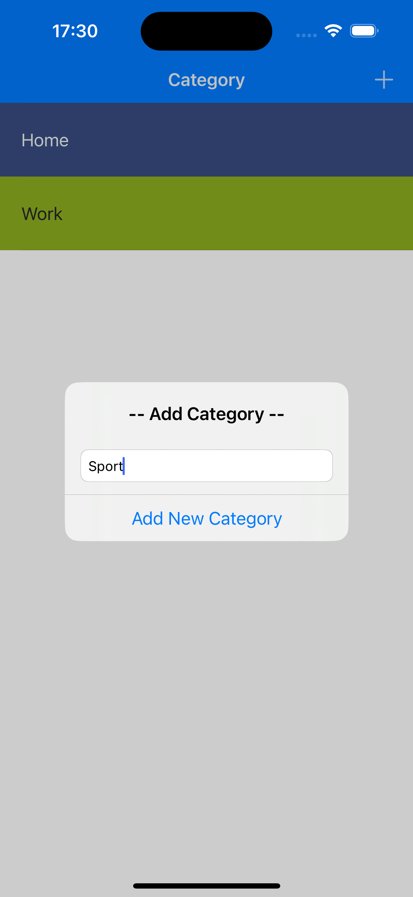

To Doey
==========================
This is a To-do list app which integrates elements from CocoaPods an use Realm Database

## Screenshots
 


## Features
* Realm Database
* Cocoapods
* MVC
* IOS Table Views
* IOS Navigation Controller
* UIKit 

## CocoaPods
* RealmDatabase
* SwipeCellKit

## How to build

1) Clone the repository

```bash
https://github.com/GorganMihai/FireChat.git
```

2) Add all pods in description

# Requirements 

* Xcode 13
* iOS 15.5
* Swift 5
